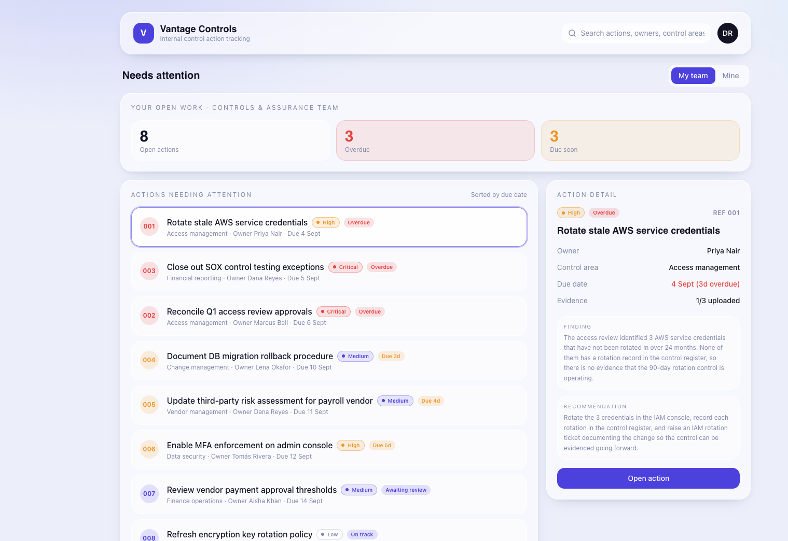
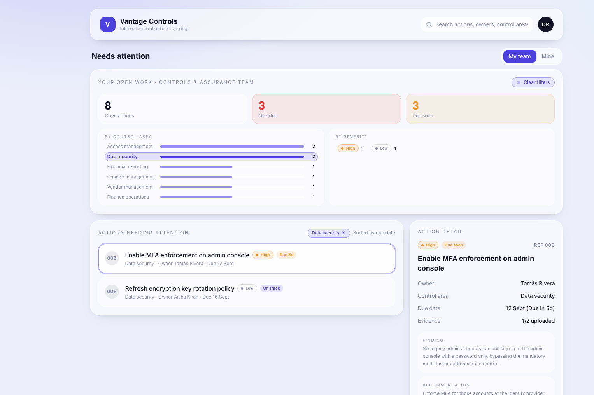

# Prototype v2: Two Upgrade Passes (Lab 2)

> Module 1 · Velocity. Same prototype, two surgical upgrade passes, closing the gap from toy to tool.

## Weakest section (from v1)

_Where does it look like a toy? Where would a VP of Design refuse to open it? Where does the logic feel fake? Pick the one spot that costs you the most credibility._

The main “Needs Attention” dashboard — the info hierarchy and prioritisation are unclear

## Upgrade paths run (pick two)

- [ ] Design Match
- [x] Add Interactivity
- [x] Surgical Refinement
- [ ] Existing Product Track

## v2 build

- **Shareable link:** https://vantage-controls.lovable.app/
- **What each pass changed:**
  - Add Interactivity: ### Path B · Add Interactivity

**Flow upgraded:**  
Dashboard workload exploration and filtering.

**What I changed:**  
Made the Control Area and Severity breakdowns interactive so users can filter the actions requiring attention directly from the dashboard summary.

**Why:**  
The dashboard provided useful workload context after the first refinement, but the breakdowns were still passive. Making them interactive allows users to move directly from understanding where attention is concentrated to exploring the relevant actions.

**Before → After:**  
Static workload breakdowns → interactive dashboard filters connected directly to the action queue.
  - Surgical Refinement: ### Path C · Surgical Refinement

**Weakest section:**  
The “Your open work” section of the main dashboard — it provided too little information to give users a meaningful overview of their current workload.

**What I changed:**  
Expanded the open-work summary to provide visibility into workload, urgency, control areas and severity while keeping the dashboard compact.

**Why:**  
The original dashboard showed basic counts but did not help users understand the composition of their open work or where attention was concentrated.

**Before → After:**  
Basic open/overdue/due-soon counts → structured overview of workload by urgency, control area and severity.

**Evidence:**  

## Show & Swap read, round 2

_A NEW partner, a blind read. What landed differently from v1?_

- **Feels like a real product, or a mockup?** It feels much more like a real product now. The purpose and the information presented are much clearer.
- **Where interactivity fell short:** I expected the Open, Overdue and Due soon summary cards and their numbers to be clickable so I could use them to filter the actions. The “By Severity” section could also be clearer, as it is not immediately obvious how it relates to the rest of the dashboard.
- **Would they show it to a VP?** Yes. I would show it to a VP because it is easy to understand what the product is trying to accomplish and how it could help the team.
