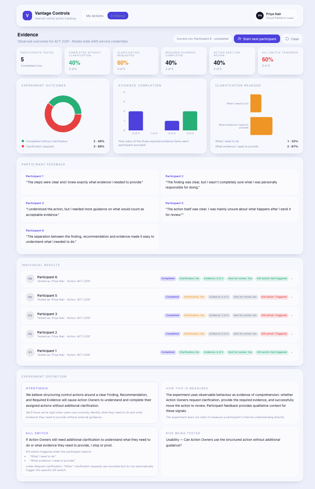

# Prototype (v3): The Build That Tests the Hypothesis

> Module 2 · Validation. The prototype is a hypothesis test, not a demo.

## Link

https://vantage-controls-validation.lovable.app/

## What it tests

_Tie it back to the validation brief: which assumption does this prototype put in front of a user?_

Sí. Vamos campo por campo como antes.
El Shareable link todavía depende de que publiques/compartas el proyecto de Lovable, así que ese simplemente será la URL.
El siguiente es:
What it tests
La pregunta exacta es “which assumption does this put in front of a user?”. M2 · Lab Guide, Vibe Coding Certification.pdfPDF
Yo pondría:
Tests whether Action Owners can understand what they need to do, identify the required evidence, and move a control action forward without additional clarification when the action is structured around a clear Finding, Recommendation, and Required Evidence.

## Context injected (no placeholders)

- **Real user quotes on screen:** No pre-existing user research quotes were available for this BYO scenario, so none were fabricated. V3 captures verbatim participant feedback during testing and displays it in the Evidence view.
- **Domain metrics on screen:** No historical product metrics were available for this BYO scenario. V3 instead captures observable experiment metrics: evidence completion, clarification requests, actions sent for review, and kill-switch outcomes.

## Iteration log (v1 → v3)

| Version | Change | Why |
|---|---|---|
| v1 | Built the initial Vantage Controls prototype with a dashboard, action queue and Action Detail. | To turn the control-action workflow into a clickable product and identify where the experience was unclear. |
| v2 | Improved the dashboard hierarchy, filtering and Action Detail based on first-read feedback. | Users understood the purpose but found the information dense and the main themes difficult to identify quickly. |
| v3 | Restructured Action Detail around Finding, Recommendation and Required Evidence, and instrumented the flow with clarification requests, evidence completion and experiment results. | To directly test whether Action Owners can understand what they need to do and what evidence they need to provide without external clarification. |

## Experiment Evidence

